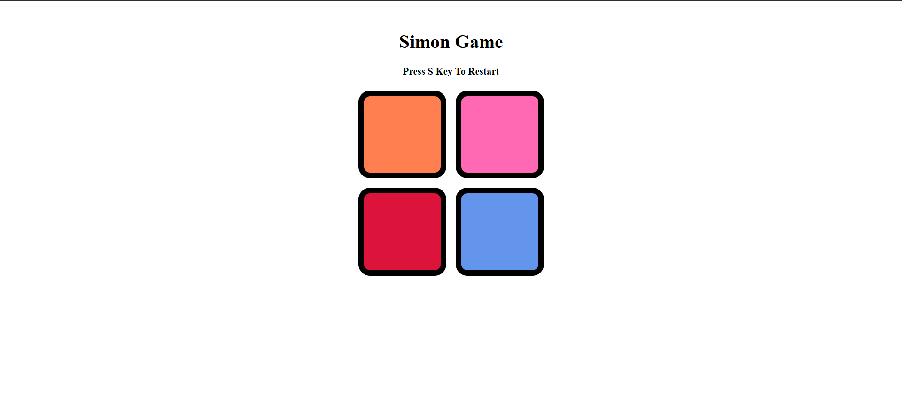

# 🎮 Simon Game

A classic **Simon Memory Game** built using **HTML**, **CSS**, and **JavaScript**.  
The goal is to remember and repeat the sequence of colors shown by the game.  
Each time you get the sequence correct, the game level increases and the pattern gets longer.

---

## 🚀 How to Play

1. **Start the Game**
   Press the **S** key to start.

2. **Game Rules**

   - Watch the sequence of color flashes carefully.
   - Click the colors in the **same order** as shown.
   - If you get it right, you move to the next level.
   - If you get it wrong, the game ends and your **final score** is displayed.

3. **Restart**
   - Press the **S** key again to restart after losing.

---

## 📋 Features

- 🎯 **Level Tracking** – See which level you're on.
- 🖱 **Mouse Click Input** – Select colors by clicking the buttons.
- 📊 **Score Display** – Shows your final score when the game ends.

---

## 🖼 Screenshot



---

## 📂 Project Structure

┣ 📜 index.html
┣ 📜 style.css
┣ 📜 script.js
┗ 📜 README.md

---

## 🛠 Technologies Used

- **HTML5** – Structure of the game
- **CSS3** – Styling and animations
- **JavaScript (ES6)** – Game logic and interactivity

---

## ▶️ How to Run Locally

1. **Clone the repository**

   ```bash
   git clone https://github.com/maheshkokate09/Simon-Game.git

   ```

2. **Navigate to the project folder**.
   ```bash
   cd simon-game
   ```
3. **Open index.html in your browser**.
   ```bash
   You’re ready to play!
   ```

---

**📌 Future Improvements**

- Add sound effects for each button.
- Add difficulty levels (easy, medium, hard).
- Make it mobile-friendly.

---

**👨‍💻 Author** ######[Mahesh Kokate](https://github.com/maheshkokate09 "Mahesh Kokate")
